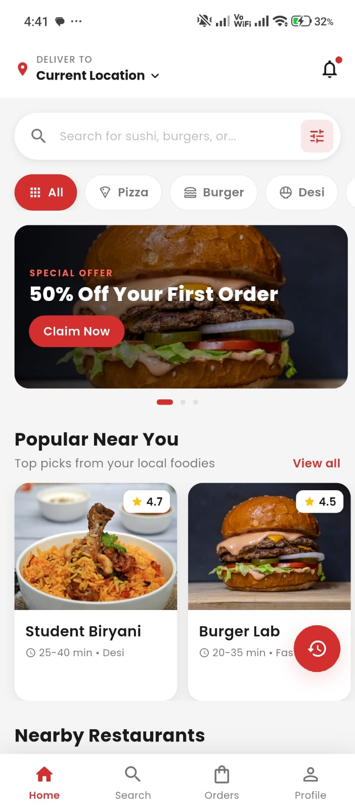
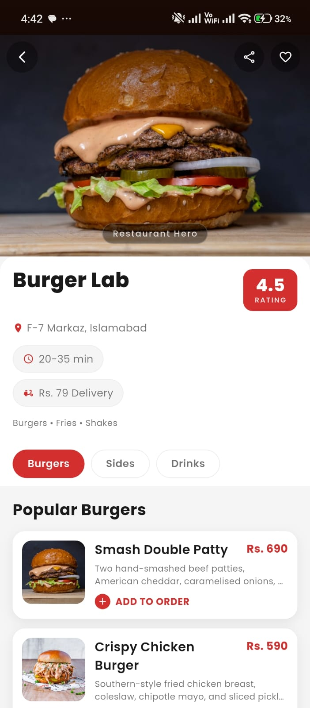
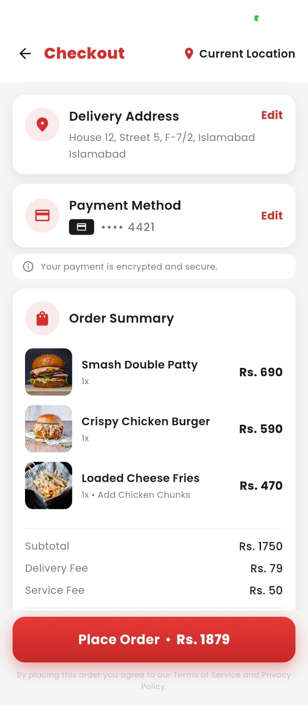
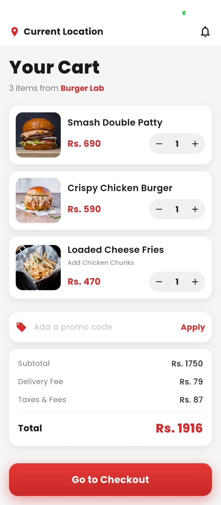
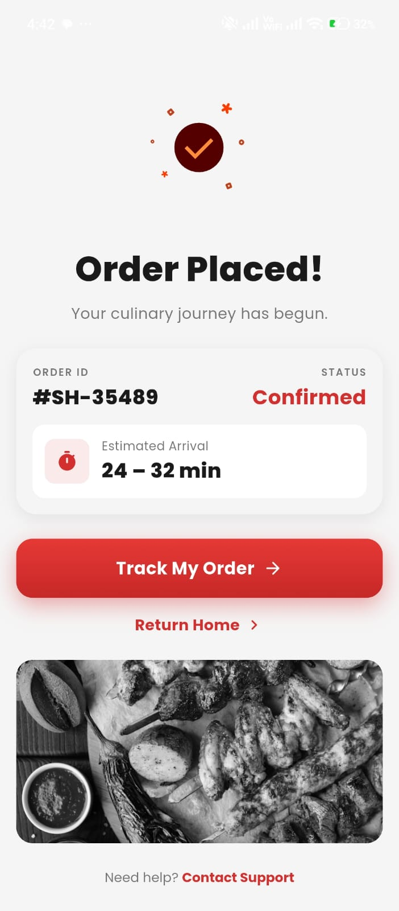
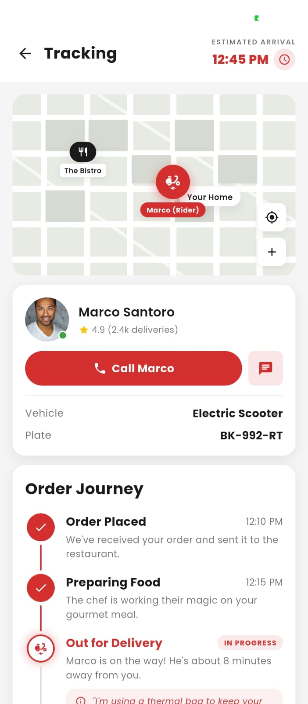

---

# 🍔 QuickBite — Food Delivery App (Flutter)

### Order faster. Deliver smarter. Grow without the chaos.

A full-featured food delivery mobile app built for independent restaurants — designed to replace WhatsApp orders, manual tracking, and delivery confusion with a clean, scalable system.

• [ GitHub ](https://github.com/fasih124/Quickbite) • [ Portfolio ](https://www.buildbyfasih.me/)

---

## 🚀 Overview

QuickBite is a **production-ready food delivery application** built using Flutter.

It is designed for **restaurant owners who want to operate like modern delivery brands** — without hiring a tech team or managing complex systems.

This project demonstrates:

- Real-world ordering flows
- Scalable app architecture
- Business-focused UX decisions
- Clean, maintainable Flutter code

---

## 🧠 The Problem

Tariq runs a popular restaurant in Islamabad. His food is loved, his customers are loyal — but his operations are broken.

Orders come through WhatsApp voice notes.  
Deliveries are tracked on paper.  
Phones ring constantly with customers asking, _“Where is my order?”_

By peak hours:

- Orders get mixed up
- Addresses are written incorrectly
- Riders are impossible to track
- Refunds come out of his own pocket

The real issue isn’t demand — it’s **lack of system**.

Tariq doesn’t need more customers.  
He needs **control, visibility, and automation**.

---

## 💡 The Solution

QuickBite is a **complete food delivery platform** that digitizes the entire ordering experience.

Customers can:

- Browse restaurants
- Customize orders
- Pay instantly
- Track deliveries live

Restaurant owners get:

- Structured orders
- Delivery tracking
- Customer history
- Automated workflows

The app is built with **Flutter**, allowing a single codebase to run on both Android and iOS — reducing cost while maintaining a smooth, native experience.

The architecture is designed to scale:

- Add new menu items instantly
- Expand to multiple locations
- Introduce promotions without code changes

---

### 🔑 Key Features

- **Live Order Tracking (No API Cost)**  
  Customers see the rider moving in real time with an ETA — eliminating constant “where is my order?” calls.

- **Smart Cart with Add-ons**  
  Users can customise meals (extra cheese, size, sides) with real-time price updates — reducing confusion and disputes.

- **Promo Code System**  
  Owners can run structured discounts (e.g. WELCOME50) instead of informal price cuts that hurt margins.

- **Order History & One-Tap Reorder**  
  Customers can repeat previous orders instantly — increasing retention without extra effort.

- **Saved Addresses & Fast Checkout**  
  Returning users can place an order in under 30 seconds — critical for conversion.

---

## 🧱 Tech Stack

Mobile Frontend:

- Flutter (Dart)

State Management:

- Riverpod 2 (StateNotifier)

Navigation:

- GoRouter (with ShellRoute)

UI / Animation:

- Google Fonts (Poppins)
- Lottie Animations
- Shimmer Loading States

Images:

- CachedNetworkImage

Data Layer:

- Mock Data (API-ready structure)

Tracking:

- CustomPainter (no Google Maps dependency)

Architecture:

- Feature-first folder structure

Deployment:

- Vercel (Demo)
- Ready for Firebase / Supabase backend integration

---

## ⚙️ Key Challenges

### 1. Shared Cart Across Multiple Screens

In a food delivery app, the cart is accessed from:

- Restaurant screen
- Search screen
- Cart screen
- Checkout

Without proper structure, the cart resets or breaks easily.

**Solution:**

- Implemented a single `CartNotifier` using Riverpod
- Centralized state across the app
- Added logic to prevent mixing items from different restaurants

**Why it matters:**  
Orders stay accurate, predictable, and error-free — critical for real businesses.

---

### 2. Real-Time Tracking Without Paid APIs

Map APIs like Google Maps introduce:

- Ongoing costs
- API limits
- Dependency risks

**Solution:**

- Built a custom tracking system using `CustomPainter`
- Animated rider movement with `AnimationController`
- Simulated map visuals with zero external services

**Why it matters:**  
The app delivers premium tracking **without any recurring cost** — ideal for small businesses.

---

## 📈 The Outcome

✓ Order time reduced from 8–12 minutes → under 60 seconds  
✓ “Where is my order?” calls reduced by 80%+  
✓ Fully trackable discount system replaces informal pricing  
✓ One-tap reorder increases repeat customer rate  
✓ Digital order records eliminate disputes and errors  
✓ Single codebase supports both Android & iOS

Built for restaurants ready to replace manual operations with a scalable digital system.

---

## 📁 Project Structure

```

lib/
├── main.dart
├── app.dart
├── core/
│ ├── theme/
│ └── widgets/
├── data/
│ └── mock_data.dart
└── features/
├── auth/
├── home/
├── restaurant/
├── cart/
├── checkout/
├── tracking/
└── profile/

```

---

## 🛠️ Setup Instructions

### 1. Clone the repository

```bash
git clone https://github.com/your-repo.git
cd quickbite
```

### 2. Install dependencies

```bash
flutter pub get
```

### 3. Run the app

```bash
flutter run
```

---

## 📸 Screenshot Guide

<table >
  <tr>
    <th>Home Screen </th>  
    <th>Restaurant Screen</th>
    <th> Checkout Screen</th>
  </tr>   
  <tr>
    <td>     </td>
    <td>  </td>
    <td> </td>
  </tr>
  <tr>
    <th>Cart Screen</th>   
    <th>Order Confirmation Screen</th>
    <th>Tracking Screen</th>
  </tr>
  <tr>
    <td> </td>
    <td> </td>
    <td> </td>
  </tr>  
</table>

---

## 💼 Use Case

Perfect for:

- Restaurants moving from WhatsApp orders
- Food startups building MVPs
- Delivery-based businesses
- Freelance client demos

---

## 📬 Work With Me

If you're building:

- A mobile app
- A delivery platform
- A SaaS product
- A real business system

I can help you build something that doesn’t just look good —
it **works in the real world**.

---
